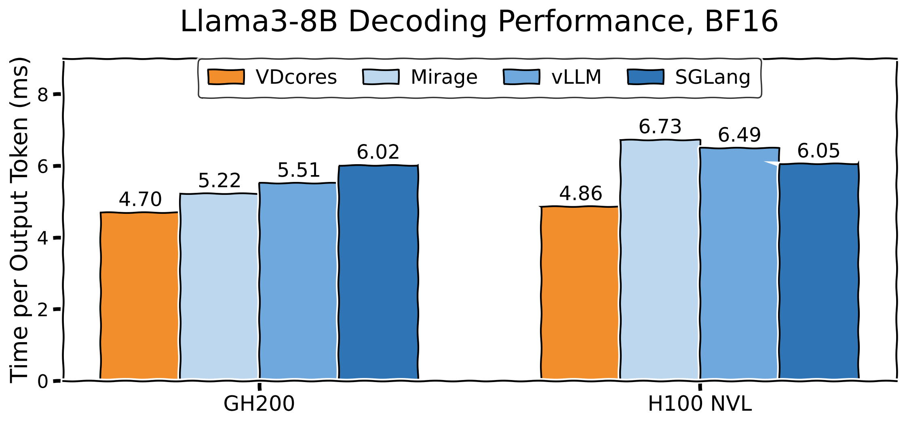

# VDCores

[](https://developer.nvidia.com/cuda-toolkit)
[](https://www.python.org/)
[](https://pytorch.org/)

VDCores is a research runtime and programming interface for modern asynchronous GPUs. It decouples GPU kernels into async executing memory and compute virtual cores and reconnects them through explicit dependencies.

Decoupling brings three key benefits:

**Asynchrony with Simplicity.** Kernel writers can focus on the computation logic while the runtime handles dynamic memory allocation, data movement, and dependency tracking under the hood. See a compact example in [`GEMV on VDCores`](include/task/gemv.cuh).

**Overlapping for free.** The VDCores runtime automatically exploits prefetching, overlap, and scheduling opportunities. Say goodbye to manually fusing stages or hand-engineering overlap for every single workload.

**Compose to adapt, on the fly.** Recompose VDCores memory, compute, and control blocks to explore schedules and swap execution plans. Adapt to changing resources or input batches by changing how VDCores instructions are connected.

Learn more about VDCores in our [paper](https://arxiv.org/abs/2605.03190) and
[blog post](https://mlsys.wuklab.io/posts/vdcores/).

## Llama 3.1-8B-Instruct Decoding Demo

The repository includes a decoding demo for `meta-llama/Llama-3.1-8B` in [`app/python/llama3/sched.py`](app/python/llama3/sched.py).




VDCores supports datacenter Blackwell SM100 and Hopper targets. The current
default build is `sm_100a`; the single-token Llama schedule is tuned for a
152-SM GB200. For the cleanest setup, start from a fresh CUDA 13.0 environment
and use [`setup.sh`](setup.sh) as the reference setup path. Blackwell task and
end-to-end measurements are recorded in
[`benchmarks/README-blackwell.md`](benchmarks/README-blackwell.md).

Typical setup:

```bash
# 1) Build the runtime object and Python extension
make pyext

# 2) Provide a Hugging Face token for gated model access
export HF_TOKEN=...

# 3) Optimize runtime and run demo
python app/python/llama3/sched.py -w
make pyext
python app/python/llama3/sched.py -N 128 "Write a hello world in Python."
```

Notes:

- A clean environment with CUDA 13.0 is recommended. If you are setting up from scratch, use [`setup.sh`](setup.sh) as the reference.
- The build defaults to `sm_100a` in [`Makefile`](Makefile) and [`setup.py`](setup.py). Set `DAE_CUDA_ARCH=90a` for a Hopper regression build.
- The tuned Llama path launches one token per VDCores megakernel. Persistent multi-token fusion is intentionally deferred to a later milestone.
- The Python extension is packaged as `dae` and links [`src/torch_runtime.cu`](src/torch_runtime.cu) with [`src/runtime.cu`](src/runtime.cu) via `runtime.o`.

## DeepSeek-V4-Flash Live Decoding Demo

[`app/python/deepseek_v4/sched.py`](app/python/deepseek_v4/sched.py) is the
user-facing demo: it formats the prompt, runs offline reference prefill,
streams text, and reports measurements.  Production flow planning and token
execution live separately in
[`python/dae/deepseek_v4_inference.py`](python/dae/deepseek_v4_inference.py),
which contains no tokenizer, reference model, or terminal UI.  A compact bank
of reusable structural flows covers ordinary tokens, ratio-4 and ratio-128
compression boundaries, context one, and long-context index selection.
Ordinary positions after the 128-row window fills can execute up to three
autoregressive tokens in one persistent launch.  The memory virtual core keeps
the absolute position and loop terminal in GPR state, derives RoPE/APE,
embedding, routing-hash, KV, and token-history addresses from those registers,
and feeds each argmax result directly into the next iteration.  Structural
compression boundaries remain single-token launches.  The host selects a
prepared span and writes only its first token; it does not rebuild or requeue
the 43-layer instruction stream.  Offline prefill and flow preparation are
reported separately and are not included in decode timing.

The demo expects the released NVIDIA DeepSeek-V4-Flash-NVFP4 checkpoint and the
offline VDCores MXFP4 FFN image.  Create the two offline artifacts once:

```bash
DSV4_CHECKPOINT=/path/to/DeepSeek-V4-Flash-NVFP4

python tools/convert_deepseek_v4_ffn_mxfp.py "$DSV4_CHECKPOINT"

python "$DSV4_CHECKPOINT/inference/convert.py" \
  --hf-ckpt-path "$DSV4_CHECKPOINT" \
  --save-path "$DSV4_CHECKPOINT/vdcores-pytorch-mp1" \
  --n-experts 256 \
  --model-parallel 1 \
  --expert-dtype fp4
```

The second artifact is a one-file, MP1 loader image for offline prefill.  The
demo explicitly dequantizes its released NVFP4 routed experts in PyTorch; no
prefill conversion or dependency is present in the timed VDCores path.

Install the checkpoint's prefill dependencies, build the compact live image,
and run a stream:

```bash
pip install -r app/python/deepseek_v4/requirements-prefill.txt
pip install --no-build-isolation \
  'git+https://github.com/Dao-AILab/fast-hadamard-transform.git@v1.1.0'

DAE_COMPUTE_OPS_FILE=benchmarks/deepseek_v4_live.ops \
  make -B -j2 num_insts=512 mxfp_direct_tma=1 pyext

python app/python/deepseek_v4/sched.py \
  --checkpoint "$DSV4_CHECKPOINT" \
  --mxfp-ffn-root "$DSV4_CHECKPOINT/vdcores-mxfp4-ffn-v1" \
  --prefill-checkpoint "$DSV4_CHECKPOINT/vdcores-pytorch-mp1" \
  -N 256 \
  --device-span-tokens 3 \
  --user-prompt "Explain how asynchronous GPU pipelines overlap memory transfers with matrix computation, then provide a concise Python example and discuss synchronization, correctness, scheduling, resource allocation, and performance tradeoffs in practical inference systems. Compare persistent kernels, CUDA graphs, tensor memory accelerators, and conventional launches for autoregressive decoding."
```

The example formats to 63 prompt tokens.  Positions before 128 retain the
single-token path needed for short-CSA host packing; later ordinary runs are
grouped without crossing a ratio-4, ratio-128, or index-selection boundary.
Set `--device-span-tokens 1` to retain one launch per token.  Stop conditions
are observed after each completed device span, so a three-token span may
speculatively compute up to two tokens beyond a stop token; those tokens are
discarded from the returned generation.  For this 256-token example, the
span-three planner prepares six reusable images and emits 161 launches.

On one GB300, a historical `--device-span-tokens 1` run spent 72.9 s on the
offline PyTorch prefill of its 62-token prefix and 52.0 s preparing four
reusable flows.  Its following 256-token VDCores decode measured a 5.411 ms
median device frontier, 6.406 ms median Python wall time, and 156.1 token/s.
With span three enabled, a real-prefill validation through position 131
measured 5.486 ms/device-token for the launch covering positions 128--130;
the median across all 70 decoded tokens was 5.463 ms/device-token.  Decode
accepts arbitrary prompt lengths within the 65,536-token live cache and up to
256 new tokens; EOS, repeated `--stop-token-id`, and
`--max-decode-seconds` can stop it earlier.  Add `--quiet-stream` to suppress
the cumulative per-token text while retaining the final completion and timing.

The imported boundary is explicit: BF16 KV caches and FP32 incremental
compressor state are retained in their VDCores layouts; the demo does not
insert an implicit hidden-state conversion.  For a fast schedule/performance
smoke test without real prefill, replace the prompt and prefill option with
`--input-token-id 1234 --decode-start-position 62 --ignore-eos`.  That mode
uses zero-initialized history and is not a text-correctness test.

## Getting Started

The codebase is organized around three layers:

- `include/dae/` and `src/`: the core runtime, virtual core abstractions, queues, allocators, launcher plumbing, and CUDA backend. Good entry points are [`include/dae/runtime.cuh`](include/dae/runtime.cuh), [`include/dae/virtualcore.cuh`](include/dae/virtualcore.cuh), [`src/runtime.cu`](src/runtime.cu), and [`src/torch_runtime.cu`](src/torch_runtime.cu).
- `include/task/`: kernel task building blocks such as attention, GEMV, RMSNorm, RoPE, SiLU, WGMMA, and argmax. Start with [`include/task/attention.cuh`](include/task/attention.cuh), [`include/task/gemv.cuh`](include/task/gemv.cuh), and [`include/task/rms_norm.cuh`](include/task/rms_norm.cuh).
- `python/dae/` and `app/python/`: Python-side model building and schedule composition. Start with [`python/dae/launcher.py`](python/dae/launcher.py), [`python/dae/schedule.py`](python/dae/schedule.py), and [`python/dae/model.py`](python/dae/model.py). End-to-end examples live in [`app/python/llama3/`](app/python/llama3) and [`app/python/qwen3/`](app/python/qwen3).

If you are new to the repository (as a model programmer want to play with schedules), a practical path is:

1. Build the extension with `make pyext`.
2. Read a small application example in [`app/python/`](app/python/) or jump directly to full LLM inference example [`app/python/llama3/sched.py`](app/python/llama3/sched.py).
3. Follow how Python schedules map to task primitives and runtime instructions through `launcher.py`, `schedule.py`, and the task headers.

## Contact and Reference

Contacts:

- Zhiyuan Guo, zhiyuang@cornell.edu
- Zijian He, zih015@ucsd.edu

Reference:

- Zijian He, Adrian Sampson, Yiying Zhang, Zhiyuan Guo, "VDCores: Resource Decoupled Programming and Execution for Asynchronous GPU", arXiv 2026, https://arxiv.org/abs/2605.03190
- Zhiyuan Guo, Zijian He, Adrian Sampson, and Yiying Zhang, “VDCores: A Runtime for Modern Async GPUs.” https://mlsys.wuklab.io/posts/vdcores/
